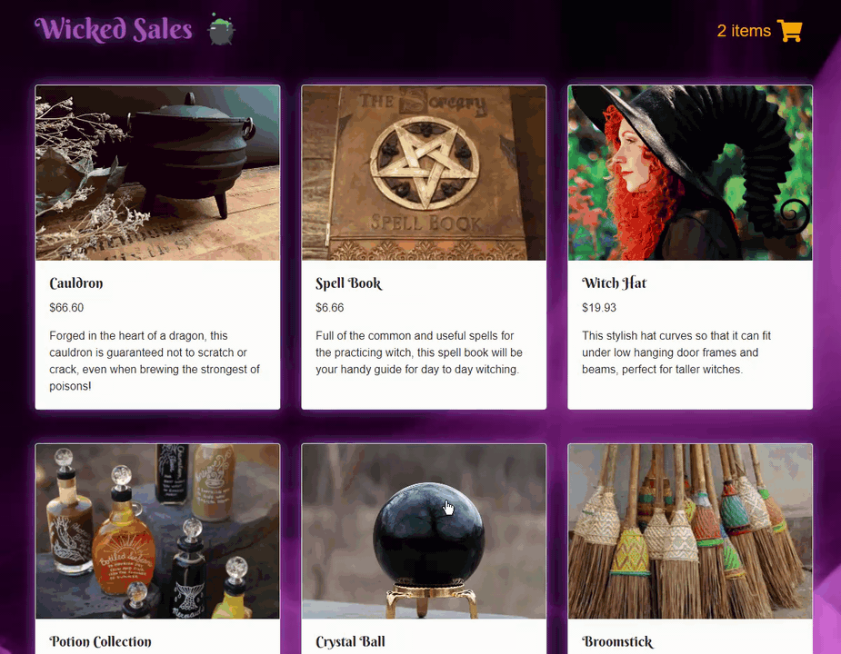

# WickedSales

A full stack Node.js and React shopping cart app.

## Technologies Used

- React.js
- Node.js
- NPM
- Bootstrap 4
- HTML 5
- CSS 3
- JavaScript
- OOP

## Website

Try the application live at [https://wickedsales.michaeljohnpoole.com/](https://wickedsales.michaeljohnpoole.com/)

## Features

- Users can view a catalog of products.
- Users can view product details by clicking on the product.
- Users can add items they want to purchase to their cart.
- Users can view their cart and see their current total.
- Users can checkout the products in their cart after providing their information.

## Preview



## Getting Started

1. Clone the repository.
```
git clone https://github.com/MichaelPooleLF/wicked-sales-js
```
2. Install the dependencies.
```
npm install
```
